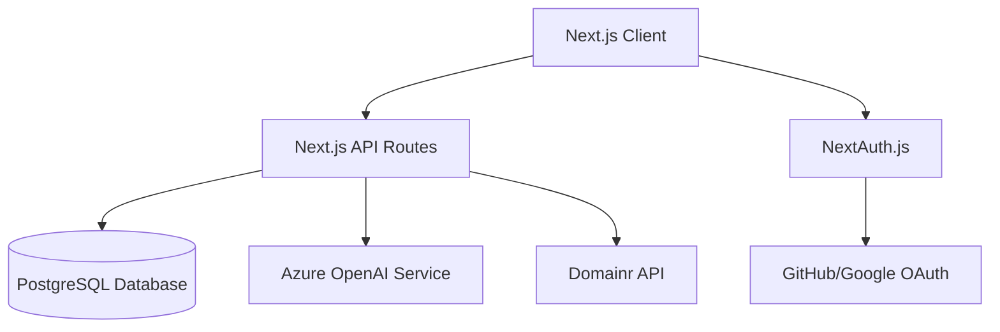

# Design Document

## Overview

IdeaLauncher MVP is a Next.js 15 web application that provides a chat-plus-canvas workspace for transforming raw startup ideas into validated, prioritized specifications. The architecture follows a modern full-stack approach with server-side rendering, real-time AI interactions, and a PostgreSQL database for persistence.

The core user experience centers around a two-pane interface: a chat panel for AI-assisted brainstorming and a living document that serves as the single source of truth for each idea. Users progress through structured phases (Ideation → Validation → Scoring → MVP Planning → Export) while maintaining all context in one evolving document.

## Architecture

### High-Level Architecture



### Application Structure

```
src/
├── app/                    # Next.js 15 App Router
│   ├── (auth)/            # Auth-protected routes
│   │   ├── dashboard/     # Ideas list and management
│   │   ├── ideas/         # Individual idea workspace
│   │   └── settings/      # User preferences
│   ├── api/               # Server-side API routes
│   │   ├── auth/          # NextAuth configuration
│   │   ├── ideas/         # CRUD operations
│   │   └── domain-check/  # Domain availability
│   └── (public)/          # Public pages (login, landing)
├── components/            # Reusable UI components
│   ├── ui/               # shadcn/ui components
│   ├── chat/             # Chat interface components
│   ├── editor/           # Document editor components
│   └── panels/           # Research, Score, MVP panels
├── lib/                  # Utilities and configurations
│   ├── auth.ts           # NextAuth configuration
│   ├── db.ts             # Prisma client
│   ├── ai.ts             # AI SDK configuration
│   └── utils.ts          # Helper functions
└── types/                # TypeScript type definitions
```

### Data Flow

1. **User Authentication**: NextAuth handles OAuth flow with GitHub/Google
2. **Idea Management**: CRUD operations through API routes with Prisma ORM
3. **AI Interactions**: Streaming responses via Vercel AI SDK with Azure OpenAI
4. **Document Updates**: Real-time autosave with optimistic UI updates
5. **Research Integration**: AI-generated content with manual insertion controls

## Components and Interfaces

### Core Components

#### 1. Dashboard (`/dashboard`)
- **IdeaGrid**: Displays ideas in sortable cards with score chips
- **CreateIdeaModal**: Form for new idea creation (title + one-liner)
- **SearchFilter**: Real-time filtering and sorting controls
- **ScoreIndicator**: Visual representation of ICE/RICE scores

#### 2. Idea Workspace (`/ideas/[id]`)
- **ChatPanel**: Left pane with conversation history and input
- **DocumentEditor**: Right pane with rich-text editing (TipTap)
- **TabNavigation**: Research, Score, MVP, Export panels
- **InsertButton**: Selective AI content insertion

#### 3. Chat System
- **MessageList**: Streaming conversation display
- **PromptInput**: User input with send/loading states
- **MessageActions**: Insert to document, copy, regenerate
- **StreamingIndicator**: Real-time response visualization

#### 4. Document Editor
- **TipTapEditor**: Rich-text editing with Markdown support
- **SectionHeaders**: Structured template (Problem, Users, Solution, etc.)
- **AutoSave**: Debounced persistence with status indicator
- **VersionHistory**: Timestamp tracking for changes

#### 5. Research Panel
- **CompetitorList**: AI-generated competitor analysis
- **MonetizationSuggestions**: Revenue model recommendations
- **NameGenerator**: Brandable name suggestions with domain check
- **InsertControls**: One-click content insertion

#### 6. Scoring Panel
- **ICESliders**: Impact, Confidence, Ease scoring (0-10)
- **ScoreCalculator**: Real-time composite score computation
- **RationaleNotes**: Text area for scoring justification
- **ScoreHistory**: Previous scoring sessions

#### 7. MVP Panel
- **FeatureList**: MoSCoW prioritized feature breakdown
- **EstimateSelector**: S/M/L effort estimation
- **DependencyMap**: Feature relationship visualization
- **TimelineEstimate**: Overall MVP timeline calculation

#### 8. Export Panel
- **SpecPreview**: Formatted Kiro-ready specification
- **ExportActions**: Copy to clipboard, download .md file
- **TemplateSelector**: Different export formats
- **ValidationCheck**: Completeness verification

### API Interface Design

#### REST Endpoints

```typescript
// Ideas Management
GET    /api/ideas              // List user's ideas
POST   /api/ideas              // Create new idea
GET    /api/ideas/[id]         // Get idea details
PATCH  /api/ideas/[id]         // Update idea
DELETE /api/ideas/[id]         // Delete idea

// AI Interactions (Streaming)
POST   /api/ideas/[id]/chat    // Chat conversation
POST   /api/ideas/[id]/research // Competitor research
POST   /api/ideas/[id]/monetize // Monetization analysis
POST   /api/ideas/[id]/naming  // Name generation

// Scoring and Planning
POST   /api/ideas/[id]/score   // Save ICE/RICE scores
POST   /api/ideas/[id]/mvp     // Generate MVP features
POST   /api/ideas/[id]/tech    // Tech stack recommendations

// Export and Utilities
POST   /api/ideas/[id]/export  // Generate Kiro spec
POST   /api/domain-check       // Domain availability
GET    /api/user/profile       // User profile data
```

#### WebSocket Events (Future Enhancement)
```typescript
// Real-time collaboration (Phase 2)
'document:update'   // Document changes
'chat:message'      // New chat messages
'user:presence'     // User activity status
```

## Data Models

### Enhanced Prisma Schema

```prisma
model User {
  id            String   @id @default(cuid())
  email         String   @unique
  name          String?
  image         String?
  createdAt     DateTime @default(now())
  updatedAt     DateTime @updatedAt
  
  // Relations
  ideas         Idea[]
  sessions      Session[]
  accounts      Account[]
}

model Idea {
  id            String   @id @default(cuid())
  title         String
  oneLiner      String?
  documentMd    String   @default("")
  
  // Computed scores for sorting
  iceScore      Float?   
  riceScore     Float?
  
  // Metadata
  phase         String   @default("ideation") // ideation, validation, scoring, mvp, export
  isArchived    Boolean  @default(false)
  createdAt     DateTime @default(now())
  updatedAt     DateTime @updatedAt
  
  // Relations
  ownerId       String
  owner         User     @relation(fields: [ownerId], references: [id], onDelete: Cascade)
  chatMessages  ChatMessage[]
  research      ResearchFinding[]
  features      Feature[]
  scores        Score[]
  exports       SpecExport[]
  
  @@index([ownerId, updatedAt])
  @@index([ownerId, iceScore])
}

model ChatMessage {
  id        String   @id @default(cuid())
  content   String
  role      String   // 'user' | 'assistant'
  metadata  Json?    // Additional context, sources, etc.
  createdAt DateTime @default(now())
  
  // Relations
  ideaId    String
  idea      Idea     @relation(fields: [ideaId], references: [id], onDelete: Cascade)
  
  @@index([ideaId, createdAt])
}

model ResearchFinding {
  id        String   @id @default(cuid())
  type      String   // 'competitor' | 'monetization' | 'naming'
  title     String
  content   String
  url       String?
  metadata  Json?    // Additional structured data
  isInserted Boolean @default(false)
  createdAt DateTime @default(now())
  
  // Relations
  ideaId    String
  idea      Idea     @relation(fields: [ideaId], references: [id], onDelete: Cascade)
  
  @@index([ideaId, type])
}

model Feature {
  id        String   @id @default(cuid())
  title     String
  description String?
  priority  String   // 'MUST' | 'SHOULD' | 'COULD'
  estimate  String?  // 'S' | 'M' | 'L'
  dependencies String[] // Array of feature IDs
  createdAt DateTime @default(now())
  
  // Relations
  ideaId    String
  idea      Idea     @relation(fields: [ideaId], references: [id], onDelete: Cascade)
  
  @@index([ideaId, priority])
}

model Score {
  id         String   @id @default(cuid())
  framework  String   // 'ICE' | 'RICE'
  
  // ICE/RICE components (0-10 scale)
  impact     Int
  confidence Int
  ease       Int?     // ICE only
  reach      Int?     // RICE only
  effort     Int?     // RICE only (inverse of ease)
  
  // Computed totals
  total      Float
  notes      String?
  createdAt  DateTime @default(now())
  
  // Relations
  ideaId     String
  idea       Idea     @relation(fields: [ideaId], references: [id], onDelete: Cascade)
  
  @@index([ideaId, createdAt])
}

model SpecExport {
  id        String   @id @default(cuid())
  format    String   @default("kiro") // Export format type
  content   String   // Generated specification
  metadata  Json?    // Export settings, version info
  createdAt DateTime @default(now())
  
  // Relations
  ideaId    String
  idea      Idea     @relation(fields: [ideaId], references: [id], onDelete: Cascade)
  
  @@index([ideaId, createdAt])
}

// NextAuth required models
model Account {
  id                String  @id @default(cuid())
  userId            String
  type              String
  provider          String
  providerAccountId String
  refresh_token     String?
  access_token      String?
  expires_at        Int?
  token_type        String?
  scope             String?
  id_token          String?
  session_state     String?
  
  user User @relation(fields: [userId], references: [id], onDelete: Cascade)
  
  @@unique([provider, providerAccountId])
}

model Session {
  id           String   @id @default(cuid())
  sessionToken String   @unique
  userId       String
  expires      DateTime
  
  user User @relation(fields: [userId], references: [id], onDelete: Cascade)
}
```

## Error Handling

### Client-Side Error Boundaries
- **Global Error Boundary**: Catches unhandled React errors
- **Route Error Boundaries**: Page-level error handling
- **Component Error Boundaries**: Isolated component failures
- **Toast Notifications**: User-friendly error messages

### Server-Side Error Handling
```typescript
// API Route Error Handler
export class APIError extends Error {
  constructor(
    message: string,
    public statusCode: number = 500,
    public code?: string
  ) {
    super(message);
  }
}

// Centralized error handling middleware
export function handleAPIError(error: unknown) {
  if (error instanceof APIError) {
    return NextResponse.json(
      { error: error.message, code: error.code },
      { status: error.statusCode }
    );
  }
  
  // Log unexpected errors
  console.error('Unexpected API error:', error);
  return NextResponse.json(
    { error: 'Internal server error' },
    { status: 500 }
  );
}
```

### AI Service Error Handling
- **Rate Limiting**: Exponential backoff for API limits
- **Timeout Handling**: Graceful degradation for slow responses
- **Fallback Responses**: Default content when AI fails
- **Stream Error Recovery**: Reconnection logic for interrupted streams

### Database Error Handling
- **Connection Pooling**: Automatic reconnection
- **Transaction Rollback**: Data consistency protection
- **Constraint Violations**: User-friendly validation messages
- **Migration Safety**: Backup and rollback procedures

## Testing Strategy

### Unit Testing
- **Components**: React Testing Library for UI components
- **API Routes**: Jest for server-side logic testing
- **Utilities**: Pure function testing with comprehensive coverage
- **Database**: Prisma client mocking and integration tests

### Integration Testing
- **API Endpoints**: End-to-end API testing with test database
- **Authentication Flow**: OAuth integration testing
- **AI Interactions**: Mocked AI responses for consistent testing
- **Document Operations**: Full CRUD workflow testing

### End-to-End Testing
- **User Workflows**: Playwright for complete user journeys
- **Cross-Browser**: Chrome, Firefox, Safari compatibility
- **Mobile Responsive**: Touch and mobile interaction testing
- **Performance**: Core Web Vitals and loading time benchmarks

### Testing Environment Setup
```typescript
// Test configuration
export const testConfig = {
  database: {
    url: process.env.TEST_DATABASE_URL,
    resetBetweenTests: true
  },
  ai: {
    mockResponses: true,
    streamingEnabled: false
  },
  auth: {
    mockProvider: 'test-provider',
    testUsers: ['test@example.com']
  }
};
```

### Performance Testing
- **Load Testing**: Concurrent user simulation
- **AI Response Times**: Streaming performance benchmarks
- **Database Queries**: Query optimization and indexing validation
- **Bundle Size**: JavaScript payload optimization

### Security Testing
- **Authentication**: Session management and token validation
- **Authorization**: Row-level security enforcement
- **Input Validation**: SQL injection and XSS prevention
- **API Security**: Rate limiting and CORS configuration

This design provides a solid foundation for the IdeaLauncher MVP while maintaining scalability for future phases. The architecture emphasizes developer experience, user performance, and maintainable code structure.